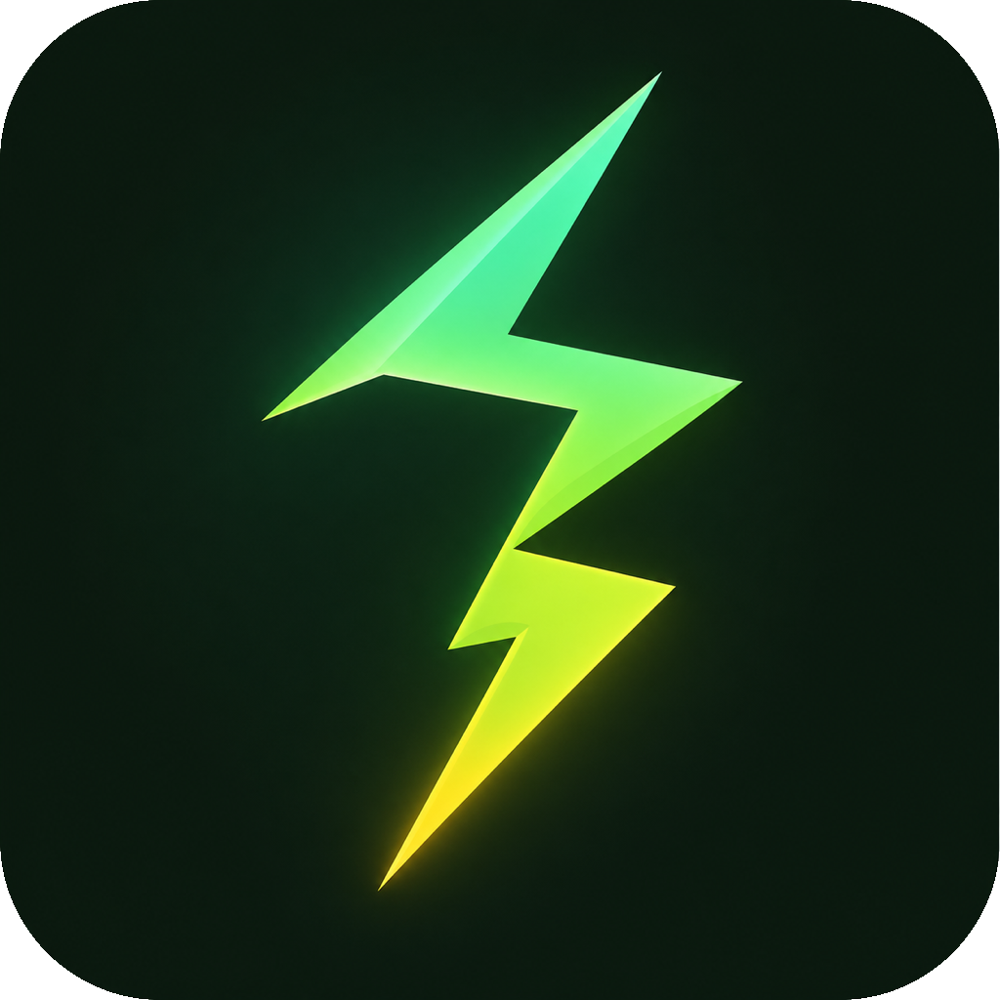
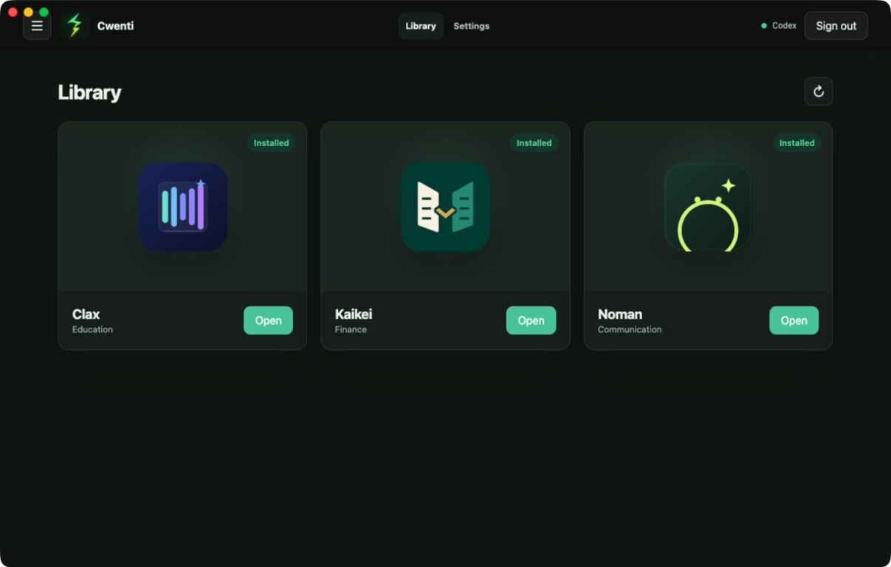
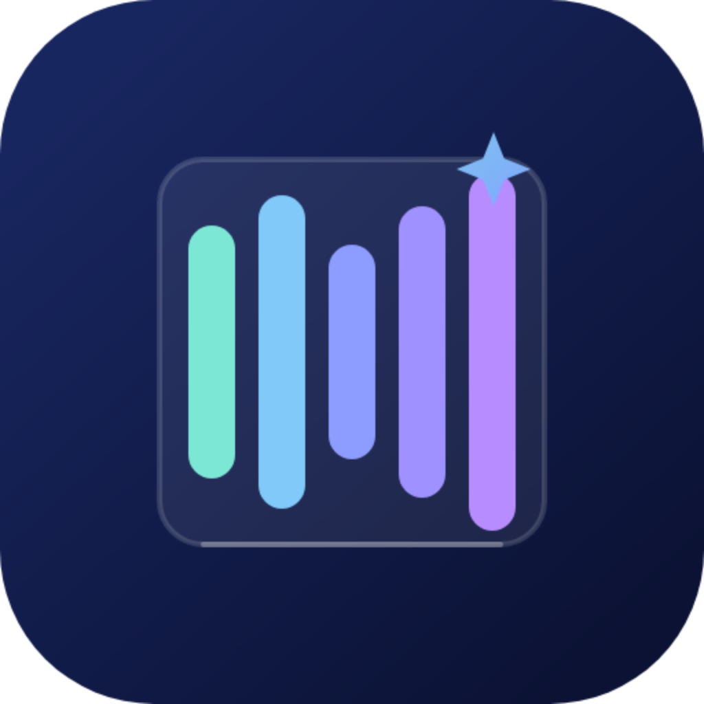
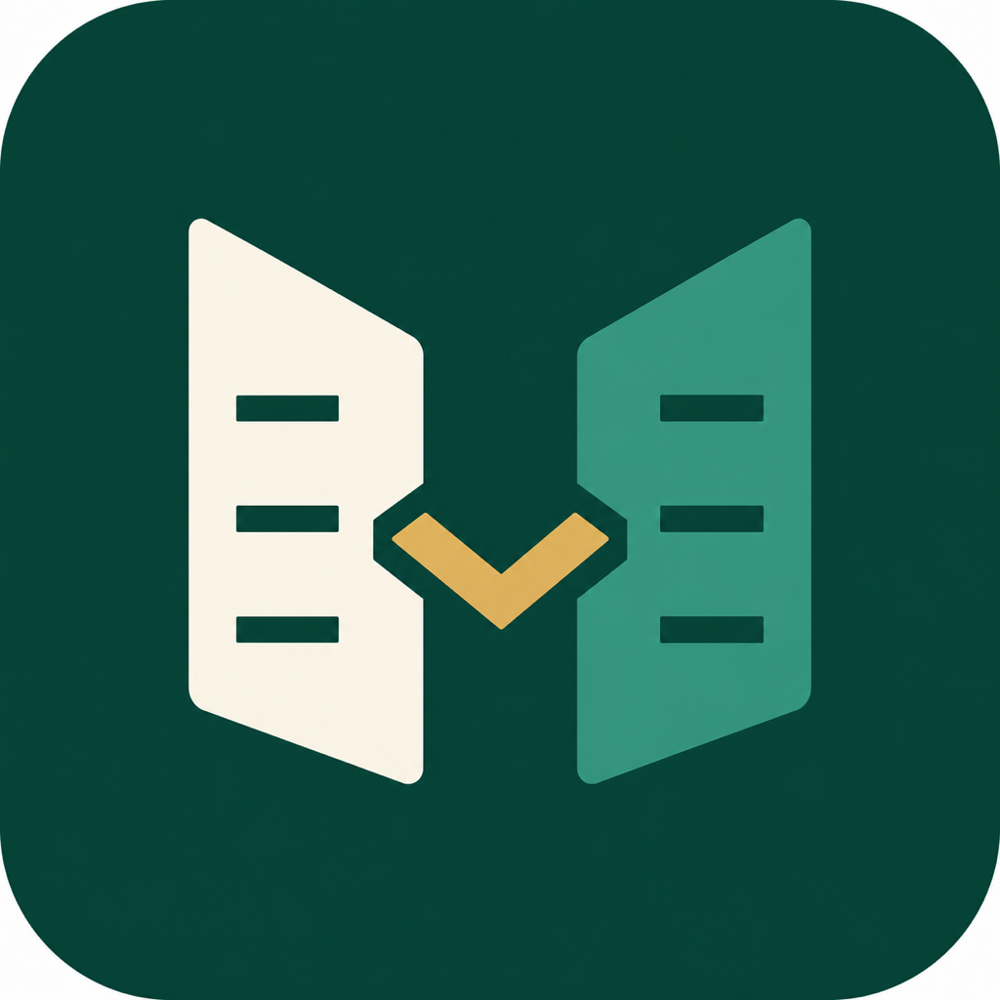
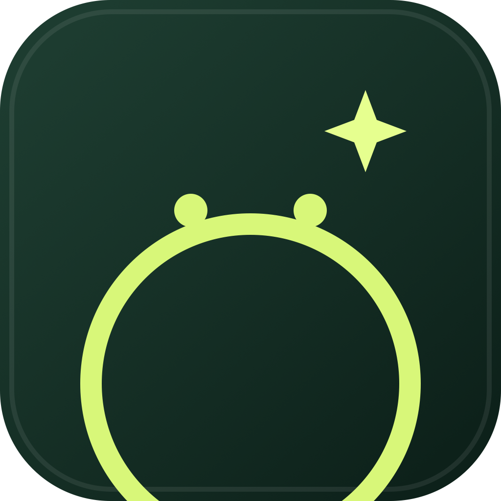
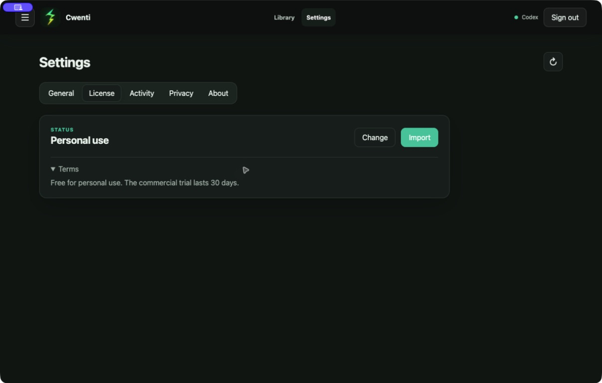

<p align="center">
  
</p>

<h1 align="center">Cwenti</h1>

<p align="center">
  <strong>Powerful apps, powered by the ChatGPT account you already use.</strong><br>
  One desktop library for Clax, Kaikei, and Noman.
</p>

<p align="center">
  <a href="https://cwenti.com">Website</a> ·
  <a href="https://github.com/mauroentey/cwenti-app/releases/latest">Download</a> ·
  <a href="#license">License</a> ·
  <a href="#español">Español</a>
</p>



## Your AI app library

Cwenti brings focused desktop apps into one launcher. Sign in through the official
Codex flow with your ChatGPT account—no separate OpenAI API key is stored by
Cwenti—and open every included app from the Library.

| App | Focus |
| --- | --- |
|  **Clax** | Education |
|  **Kaikei** | Finance |
|  **Noman** | Communication |

- Clax, Kaikei, and Noman are included with every Cwenti installation.
- English is the default interface language; Spanish is available in Settings.
- One Cwenti update refreshes the launcher and all three bundled apps.
- The launcher runs locally and does not add its own telemetry.

## Download

The current release provides:

- [macOS for Apple Silicon](https://github.com/mauroentey/cwenti-app/releases/latest)
- [Windows x64](https://github.com/mauroentey/cwenti-app/releases/latest)

The current macOS build is ad hoc signed but not Apple-notarized. The Windows
build does not yet have a commercial code-signing certificate, so the operating
system may show a security warning.

## How it works

1. Install Cwenti; the complete app library is included.
2. Choose personal use, start the 30-day commercial trial, or import a commercial license.
3. Sign in with ChatGPT through Codex.
4. Open Clax, Kaikei, or Noman from the Library.

Cwenti talks to Codex App Server over local `stdio`. It does not run a public
HTTP server, intercept ChatGPT credentials, or store OpenAI tokens.

## Language

English is selected on first launch. To use Spanish, open
**Settings → General → Language → Español**.

## License

Cwenti is source-available under the
[Prosperity Public License 3.0.0](LICENSE):

- Personal and noncommercial use is free.
- Commercial use is allowed for a single 30-day trial per organization.
- Continued commercial use requires a separate commercial license.

Prosperity is not an OSI-approved open-source license, so Cwenti should be
described as **source-available**, not open source. Commercial license files are
verified offline with Ed25519 signatures; private signing keys are not included
in the repository or application.

For commercial licensing, contact
[mauro@entey.net](mailto:mauro@entey.net). See
[commercial terms](COMMERCIAL-LICENSE.md),
[trademark policy](TRADEMARKS.md), and
[licensing implementation](docs/LICENSING.md).



## Development

Requirements: Node.js 22+, npm 10+, and macOS or Windows.

```bash
npm ci
npm run dev
```

Run the complete verification suite:

```bash
npm run verify
npm run test:smoke
npm run licenses
```

Platform builds:

```bash
npm run download:apps
npm run dist:mac:arm64
# Run the Windows command on Windows:
npm run dist:win
```

The suite lock pins the official Clax, Kaikei, and Noman release ZIPs by
version, exact size, and SHA-256. Packaging fails before extraction if any
download differs from that lock.

Read the focused documentation for
[Codex integration](docs/CODEX_INTEGRATION.md),
[security](docs/SECURITY.md),
[releases](docs/RELEASING.md), and
[the bundled app format](docs/APP_FORMAT.md).

## Privacy and security

The renderer uses Electron isolation, sandboxing, a restrictive CSP, and a
limited preload bridge. Settings, license state, permissions, history, and logs
stay in the local Cwenti data directory. Codex may send the prompt and approved
context required to complete an AI task to OpenAI under the account used to sign
in; Cwenti does not receive a separate copy through launcher telemetry.

Cwenti is an independent product and is not affiliated with OpenAI. ChatGPT and
Codex are trademarks of their respective owner.

---

<details id="español">
<summary><strong>Español</strong></summary>

### Tu biblioteca de aplicaciones con IA

Cwenti reúne Clax, Kaikei y Noman en una sola biblioteca de escritorio. Las
tres aplicaciones vienen incluidas y utilizan el inicio de sesión oficial de
Codex con tu cuenta de ChatGPT; Cwenti no guarda una API key de OpenAI.

- Inglés es el idioma predeterminado.
- Español se activa en **Settings → General → Language → Español**.
- Una actualización de Cwenti actualiza también las aplicaciones incluidas.
- El launcher funciona localmente y no agrega telemetría propia.

### Licencia

Cwenti usa la
[Prosperity Public License 3.0.0](LICENSE). El uso personal y no comercial es
gratuito. El uso comercial tiene una única prueba de 30 días por organización;
después requiere una licencia comercial independiente. Es software de código
disponible, no software open source aprobado por la OSI.

Para licencias comerciales, escribe a
[mauro@entey.net](mailto:mauro@entey.net).

</details>
